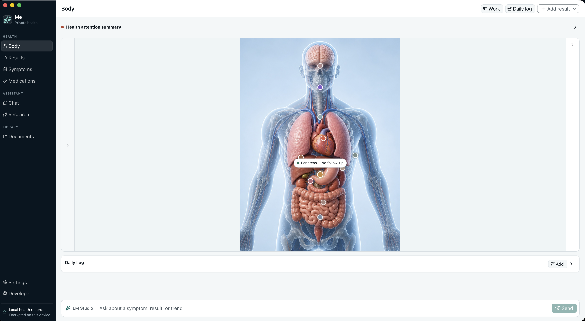

For a while I've been thinking about an app to keep track of my health properly, where I'm in control, fully local LLMs (with the option to use remote LLMs if desired).

I'm getting old and I've been going more and more to multiple doctors and clinics, and I wanted a place to centralize and visualize my health in an easy way.

It's open source: https://github.com/memogarcia/my-health

It's not medical advice. Any real decision belongs with a doctor.
