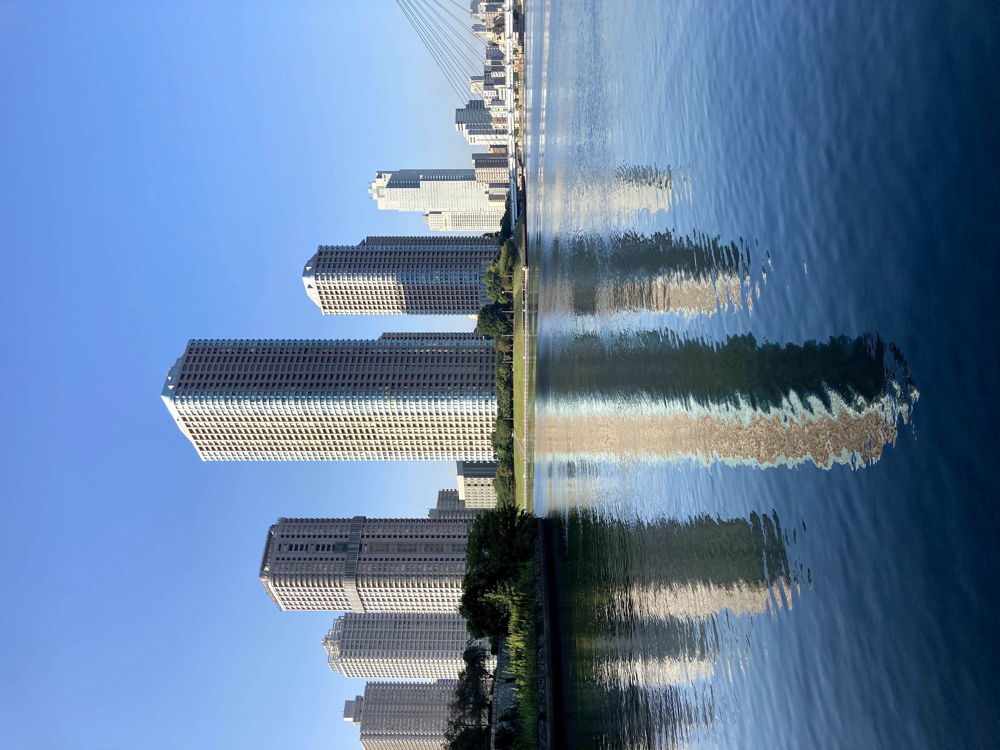

In this series of posts I propose a not so perfect analogy for computer networks represented as buildings.

1. [Networks and subnets or building layouts](../posts/understanding-computer-networks-by-analogy/)
2. [Switches and routers or how rooms can communicate between floors](../posts/understanding-computer-networks-by-analogy-part-2/)
3. [Network protocols or how rooms communicate](../posts/understanding-computer-networks-by-analogy-part-3/)
4. [Internet, public IPs, NAT, DNS or how to connect rooms between buildings](../posts/understanding-computer-networks-by-analogy-part-4/)
5. [High performance networking or how to speed up the communication](../posts/understanding-computer-networks-by-analogy-part-5/)
6. [SDN or dynamic floor arrangement](../posts/understanding-computer-networks-by-analogy-part-6/)
7. [Mesh networks](../posts/understanding-computer-networks-by-analogy-part-7/)
<!-- 8. [Network security](../posts/understanding-computer-networks-by-analogy-part-8/) -->
<!-- 9. [Network management](../posts/understanding-computer-networks-by-analogy-part-9/) -->
<!-- 10. [Network monitoring](../posts/understanding-computer-networks-by-analogy-part-10/) -->
<!-- 11. [Network troubleshooting](../posts/understanding-computer-networks-by-analogy-part-11/) -->
<!-- 12. [Network automation](../posts/understanding-computer-networks-by-analogy-part-12/) -->
<!-- 13. [Network virtualization](../posts/understanding-computer-networks-by-analogy-part-13/) -->
<!-- 14. [Network economics](../posts/understanding-computer-networks-by-analogy-part-14/) -->
<!-- 15. [Networks and the Internet of Things](../posts/understanding-computer-networks-by-analogy-part-15/) -->
<!-- 16. [Networks and the cloud](../posts/understanding-computer-networks-by-analogy-part-16/) -->